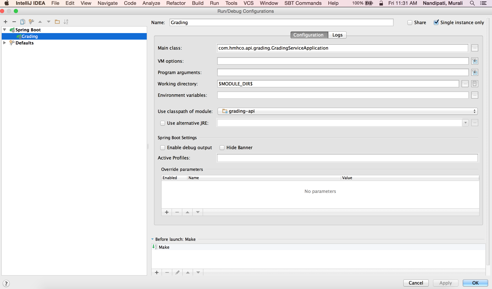
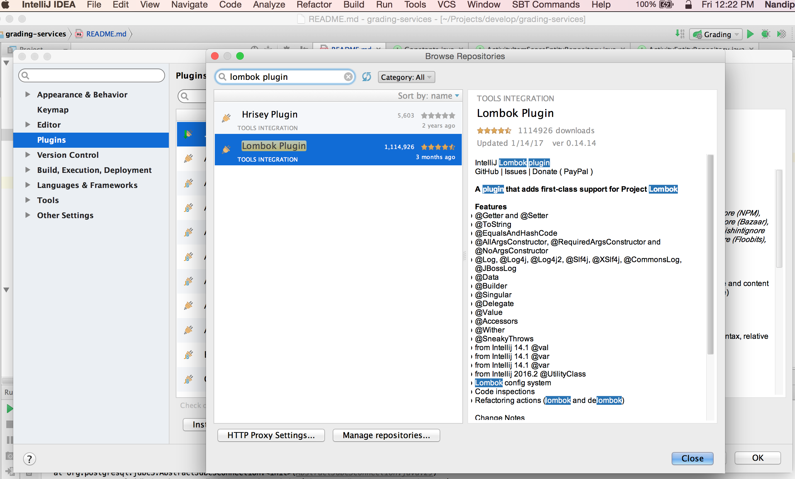
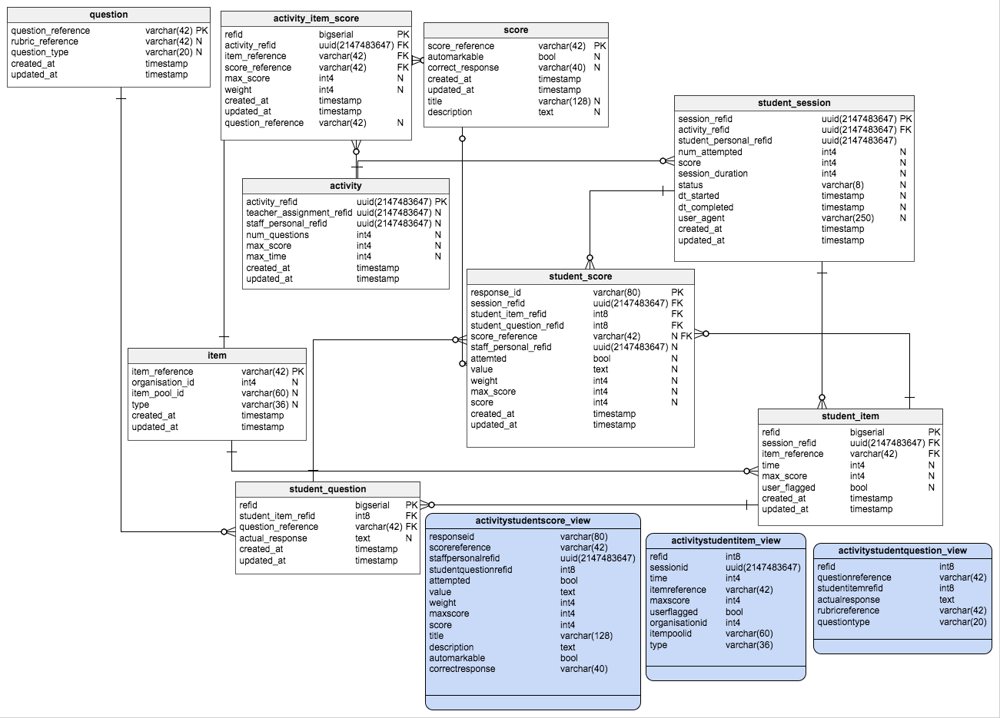
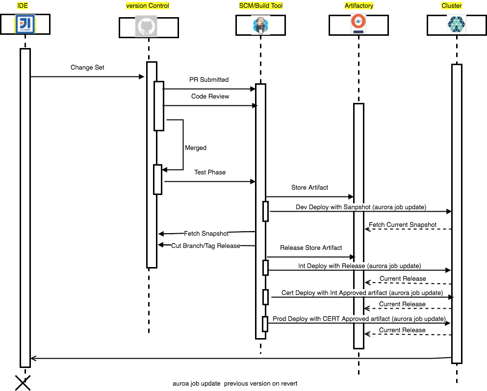
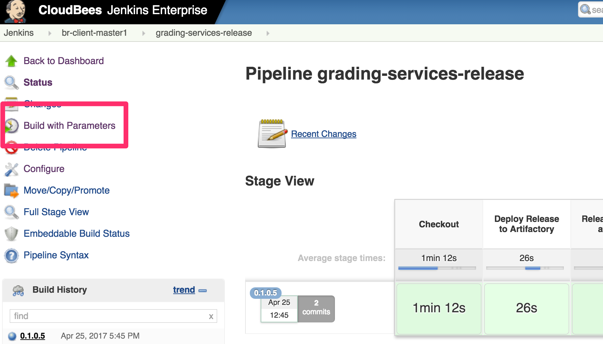
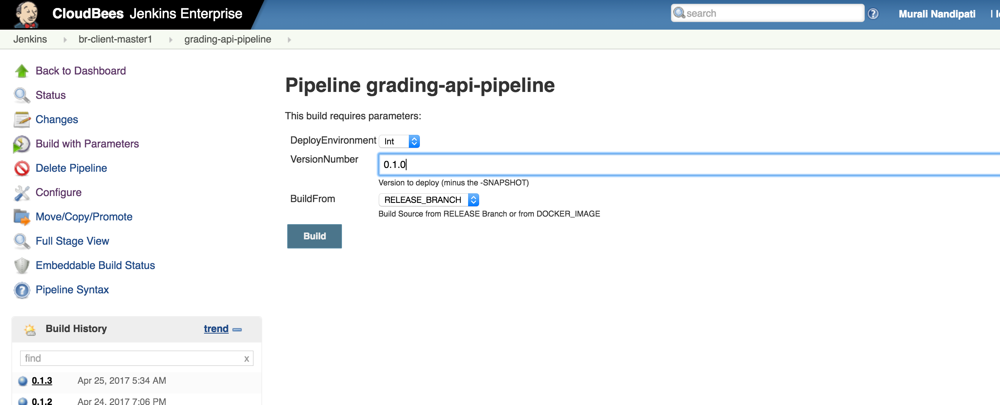
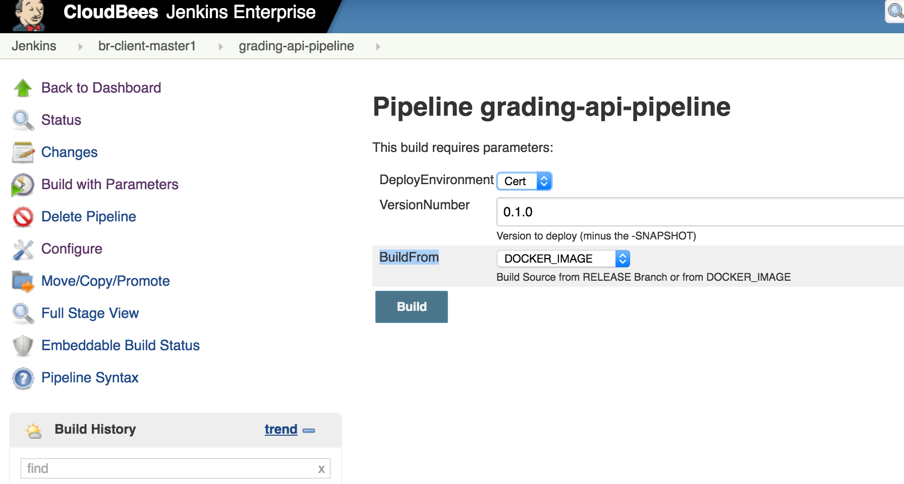

# grading-service
The Grading Service accepts student responses, marks them as correct, incorrect, or partially correct either algorithmically or manually, and then submits them to the Scoring Service

## Set up (Mac)

### Folders of interest

mkdir -p ~/{Projects,Virtualenvs}

### Install Homebrew

ruby -e "$(curl -fsSL https://raw.githubusercontent.com/Homebrew/install/master/install)"

Xcode Command Line Tools Xcode > Preferences > Downloads > Command Line Tools

### Install Homebrew extension Cask

brew install caskroom/cask/brew-cask

### Install applications via Homebrew Cask

for app in atom github vagrant vagrant-manager virtualbox \
           box-sync dropbox slack boot2docker intellij-idea; do
    brew cask install ${app}
done

### Install common applications via Homebrew

brew install ack autojump automake colordiff curl git git-flow gnu-sed gnu-which gnu-tar gnutls \
             gnu-getopt hub icoutils imagemagick libmemcached memcached openssl ossp-uuid qt \
             go readline redis tmux wget scala python node

### Node / NPM

npm install -g npm@latest

for app in grunt-cli express bower; do
    npm install -g ${app}
done

## Git

### Setup Github

ssh-keygen -t rsa -C "${my_email_address}"

ssh-add ~/.ssh/id_rsa (Copy ssh key to github.com)

ssh -T git@github.com (Test connection)

### Set git config values
git config --global user.name "${FULL_NAME}"
git config --global user.email "${GIT_EMAIL}"
git config --global github.user ${GITHUB_USERNAME}
git config --global github.token ${your_github_token_here}

git config --global core.editor "vim"
git config --global color.ui true

The virtual environment set up the line
echo "source /usr/local/bin/virtualenvwrapper.sh" >> ~/.extra"

The line should be
echo "source /usr/local/bin/virtualenvwrapper.sh >> ~/.extra"

to start the virtual environment,
the commands must be executed in the following order.

source which virtualenvwrapper.sh
source ~/.bash_profile

Note :- Fork you to own github repository https://github.com/hmhco/grading-services
 
git clone git@github.com:{gitusername}/grading-services.git

### Vagrant

cd grading-api 

vagrant up

### IntelliJ IDEA

Download from https://www.jetbrains.com/idea/download/#section=mac



### Install Lombok plugin

IntelliJ IDEA --> preferences --> plugins --> Browse repositories




## Data Model

[GradingDataModel - updated on 05/22/2017](docs/datamodel/GradingDatamodel_0522-2017-05-22_18_53)



### Data Model Documentation 

[GradingDataModel - updated on 05/22/2017](docs/datamodel/GradingDatamodel_Documentation_05222017.pdf)


## Continuous Delivery Work Flow




## Release for INT/CERT/PROD

https://jenkins.br.hmheng.io/job/grading-services-release/

Click on **Build with Parameters**



Select **RELESASE** from Artifact Type

Select **master** from Branch

Click on **Build**


**DEPLOY TO INT**

https://jenkins.br.hmheng.io/job/grading-api-pipeline/

Click on "Build with Parameters"



```sh
DeployEnvironment - int
VersionNumber - Current Release version (Modify the version before running Build)
BuildFrom - select RELEASE_BRANCH
Click on "Build" button
```

## Deploy CERT/Prod environment

https://jenkins.br.hmheng.io/job/grading-api-pipeline/

Click on "Build with Parameters"



```sh
DeployEnvironment - cert/prod
VersionNumber - Current Release version (Modify the version before running Build)
BuildFrom - select DOCKER_IMAGE
Click on "Build" button
```
