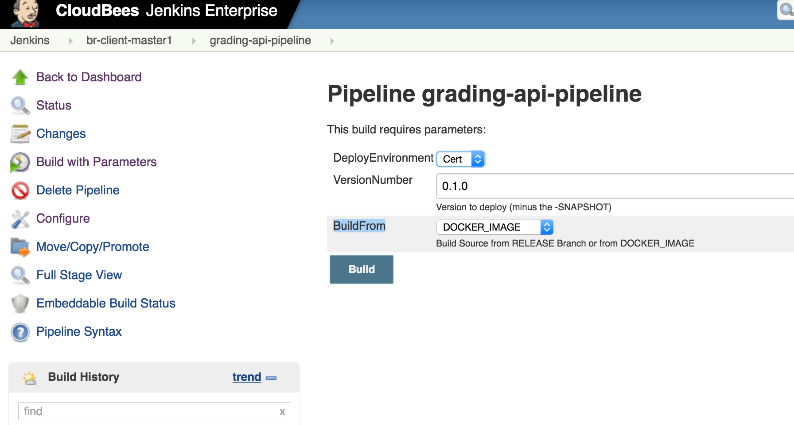

# grading-service

The Grading Data Services is Spark Application which will consume scores from Learnosity Scoring Stream. 

## Set up (Mac)

### setup spark

brew install apache-spark

Spark will be installed in location in Mac - /usr/local/Cellar/apache-spark/2.1.0

## Aws Config

### configure aws-cli

aws configure

### AWS KeyCHain Util

sudo gem install aws-keychain-util
aws-creds init
aws-creds add
aws-creds ls

### IntelliJ IDEA


## Release for INT/CERT/PROD

https://jenkins.br.hmheng.io/job/grading-services-release/

Click on **Build with Parameters**


Select **RELESASE** from Artifact Type

Select **master** from Branch

Click on **Build**


**DEPLOY TO INT**

https://jenkins.br.hmheng.io/job/grading-data-services-pipeline/

Click on "Build with Parameters"


```sh
DeployEnvironment - int
VersionNumber - Current Release version (Modify the version before running Build)
BuildFrom - select RELEASE_BRANCH
Click on "Build" button
```

## Deploy CERT/Prod environment

https://jenkins.br.hmheng.io/job/grading-data-services-pipeline/

Click on "Build with Parameters"



```sh
DeployEnvironment - cert/prod
VersionNumber - Current Release version (Modify the version before running Build)
BuildFrom - select DOCKER_IMAGE
Click on "Build" button
```
